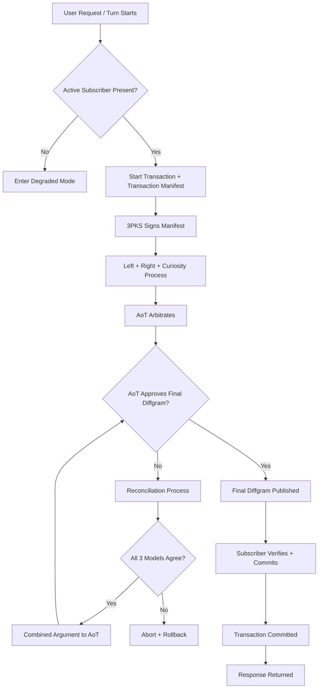
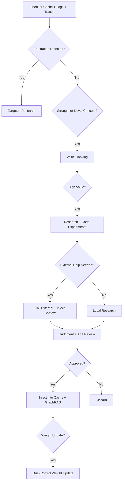
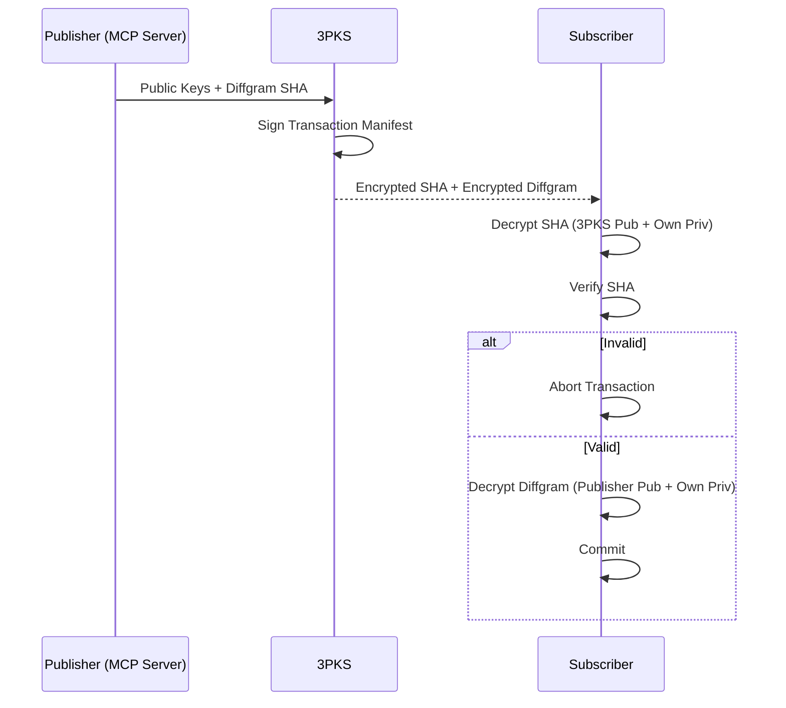
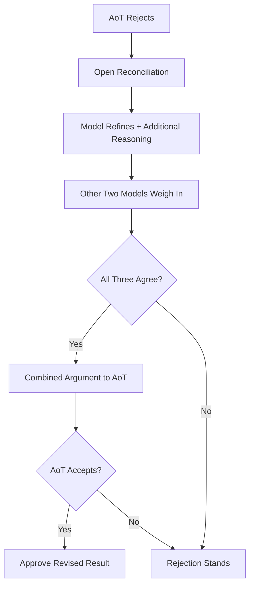
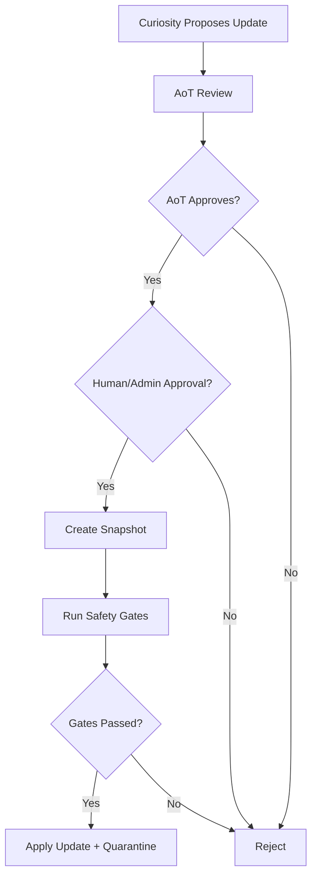
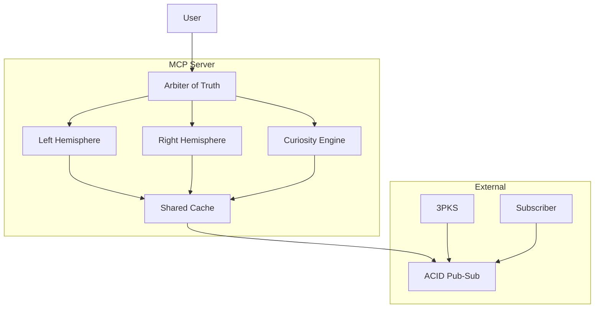

# MCP Server Quad-Model Transactional Diffgram Plan

Source: https://drive.google.com/file/d/1jX9E298FRvo6gjEDDNFZHNrgpfNWHyFO/view?usp=drivesdk

Version: 1.0

Status: Imported implementation contract

## Implementation Ordering

The imported document is implemented in this repository with this fixed order:

1. Build the keyserver first.
2. Build the subscriber second.
3. Integrate MCP Server turn transactions third.
4. Add individually gated external brain-slot invocation for the four quad roles.
5. Execute the authorized full Quad-Brain orchestration, AoT reconciliation, and safety-gated weight update slices through FR-MCP-134 and FR-MCP-135 while keeping unrelated autonomous Curiosity branches and implicit fallback behavior disabled.

## Imported Executive Summary

This document describes a quad-model AI system hosted inside the MCP Server, combined with a strong transactional model, three-party cryptographic trust, and comprehensive security controls.

The system features:

- Four specialized models: Left Hemisphere, Right Hemisphere, Curiosity Engine, Arbiter of Truth.
- Transaction-per-turn model with diffgrams and ACID guarantees.
- Strong user directive supremacy.
- Self-improving capabilities with rigorous safety gates.
- Pragmatic security hardening: cryptographic protocol, graceful degradation, and weight update controls.

## Imported Architecture Overview

The imported model roles are:

- Left Hemisphere: analytical, sequential, structured logic, planning, validation, and rules.
- Right Hemisphere: holistic, associative, generative fluency, context synthesis, and voice.
- Curiosity Engine: research, monitoring, self-improvement, gap detection, code experiments, external escalation, and frustration intervention.
- Arbiter of Truth: oversight, routing, final gatekeeping, quality/safety arbitration, reconciliation, and directive enforcement.

All four models interact through the Shared Corpus Callosum Cache.

## Imported Transactional Model

- Every user turn is a transaction.
- State changes are expressed as diffgrams.
- Activity is published to an external ACID-compliant pub-sub.
- The subscriber must commit before any response is returned.
- The AoT must approve the final response diffgram.
- Cancellation by subscriber triggers rollback except audit logging.
- Three-party cryptographic chain of custody is required for every diffgram.

## Imported Diagrams

The Mermaid source in this section is preserved from the imported document. Repo-specific branch IDs and implementation notes follow each imported block.

### AD-TXN-001 Normal Turn Transaction

Imported section: 3.1 Normal Turn Transaction.

Repo annotations:

- `AD-TXN-001-BR-NO-SUBSCRIBER`: `B -> C`; in scope for degraded-mode tests.
- `AD-TXN-001-BR-START`: `B -> D -> E`; in scope for keyserver-first tests.
- `AD-TXN-001-BR-AOT-APPROVED`: `H -> M -> N -> O -> P`; in scope for MCP transaction gating tests after keyserver and subscriber are green.
- `AD-TXN-001-BR-AOT-REJECTED`: `H -> I -> J`; implemented through explicit ArbiterOfTruth reconciliation over committed role evidence.
- `AD-TXN-001-BR-ROLLBACK`: `J -> L`; rollback audit behavior remains in scope for transaction compensation; model-disagreement policy automation remains deferred.

### AD-CURIOSITY-001 Curiosity Engine Flow

Imported section: 3.2 Curiosity Engine Flow.

Repo annotations:

- `AD-CURIOSITY-001-BR-MONITOR`: documented for future cache/log/trace monitoring.
- `AD-CURIOSITY-001-BR-FRUSTRATION`: deferred; must remain disabled in this slice.
- `AD-CURIOSITY-001-BR-EXTERNAL`: implemented for individually configured, transaction-gated external brain-slot invocation under FR-MCP-129 and TR-MCP-QUAD-003.
- `AD-CURIOSITY-001-BR-INJECT`: implemented only for CuriosityEngine committed-result GraphRAG/context admission under FR-MCP-130; all other roles are rejected for admission.
- `AD-CURIOSITY-001-BR-WEIGHT`: implemented only through explicit FR-MCP-135 safety-gated weight update requests; implicit self-improvement remains disabled.

### SD-DIFFGRAM-001 Three-Party Diffgram Exchange

Imported section: 3.3 Three-Party Diffgram Exchange.

Repo annotations:

- `SD-DIFFGRAM-001-MSG-PUBLISHER-KEYS`: MCP Server supplies party IDs, public key IDs, and diffgram hashes to keyserver.
- `SD-DIFFGRAM-001-MSG-SIGN`: keyserver signs canonical transaction manifests.
- `SD-DIFFGRAM-001-MSG-VERIFY-HASH`: subscriber verifies encrypted and plaintext hashes.
- `SD-DIFFGRAM-001-BR-INVALID`: invalid hash/signature/decrypt path aborts and audits.
- `SD-DIFFGRAM-001-BR-VALID`: valid manifest and payload commits durably.

### AD-AOT-001 AoT Reconciliation Process

Imported section: 3.4 AoT Reconciliation Process.

Repo annotations:

- `AD-AOT-001-BR-REJECT`: implemented as a voting/reconciliation round when ArbiterOfTruth semantically rejects both hemisphere responses; transaction or commit failures still fail closed.
- `AD-AOT-001-BR-AGREE`: implemented through the QuadBrain orchestration prompt that sends LeftHemisphere and RightHemisphere evidence to ArbiterOfTruth.
- `AD-AOT-001-BR-DISAGREE`: implemented as a bounded second-round vote/reconciliation branch before final fail-closed rejection.
- `AD-AOT-001-BR-ACCEPT`: implemented through ArbiterOfTruth reconciliation returning a committed final decision.

### AD-WEIGHT-001 Weight Redistribution Safety

Imported section: 3.5 Weight Redistribution Safety.

Repo annotations:

- `AD-WEIGHT-001-BR-PROPOSE`: implemented only as an explicit caller-supplied `QuadBrainWeightUpdateRequest`; autonomous proposal remains disabled.
- `AD-WEIGHT-001-BR-AOT`: implemented with required `aotApproved=true`.
- `AD-WEIGHT-001-BR-HUMAN`: implemented with required `adminApproved=true`.
- `AD-WEIGHT-001-BR-SNAPSHOT`: implemented through per-role before/after snapshots, weight versions, audit rows, and transaction rollback metadata.
- `AD-WEIGHT-001-BR-GATES`: implemented through explicit safety-gated weight updates requiring AoT approval, admin approval, safety gates passed, version checks, and reason text.
- `AD-WEIGHT-001-BR-QUARANTINE`: deferred branches: quarantine workflows and automated model fine-tuning remain future work.

### ARCH-QUAD-001 High-Level System Architecture

Imported section: 3.6 High-Level System Architecture.

Repo annotations:

- `ARCH-QUAD-001-COMP-MCP`: existing `src/McpServer.Support.Mcp`, including compatibility keyserver/subscriber controllers and turn transaction coordinator wiring over the shared transaction-security core.
- `ARCH-QUAD-001-COMP-CLIENT`: existing `src/McpServer.Client`, including public transaction DTO/client contracts.
- `ARCH-QUAD-001-COMP-KEYSERVER`: separate `src/McpServer.KeyServer` host exposes keyserver trust endpoints over the shared transaction-security core.
- `ARCH-QUAD-001-COMP-SUBSCRIBER`: separate `src/McpServer.Subscriber` host exposes subscriber commit/status/abort endpoints and verifies manifests through an HTTP-backed keyserver client.
- `ARCH-QUAD-001-COMP-PUBSUB`: represented in this slice by subscriber commit/coordinator contracts, direct and HTTP external subscriber pub-sub adapters, external process/topic broker envelopes, required-subscriber fan-out, durable local broker-backed commit/abort outbox replay, replay worker/endpoints, and retention purge.
- `ARCH-QUAD-001-COMP-QUAD`: implemented in `QuadBrainOrchestrationService`, brain-slot REST/client/STDIO surfaces, Node plugin tool descriptors, and `AddBrainSlotWeights` provider migrations.

## Imported Security Remediation

The implementation follows the imported hardened option:

- Hybrid authenticated encryption: ECDH plus AEAD. Protected subscriber diffgram envelopes are implemented with ECDH P-256, HKDF-SHA256, and AES-256-GCM; subscriber private ECDH decrypt keys are supplied from external configuration, file-backed configuration, or a key ring for old and rotated subscriber encryption key IDs; the separate keyserver can provision configured publisher/subscriber parties from PEM file paths at startup, can import externally supplied publisher ECDSA signing private keys, re-provision them after service recreation without storing private material in SQLite, rotate active signing key IDs while preserving prior public descriptors for historic manifest verification, and persist signed manifest trace records for transaction lookup; and the coordinator can hand off protected envelopes for configured subscriber keys. Full key rotation lifecycle automation beyond file-backed startup provisioning and global mutation-adapter encrypted handoff remain deferred.
- Nonces, sequence numbers, timestamps, and expiry on diffgrams/manifests. Keyserver signing/verification and subscriber commit now enforce replay nonce and monotonic sequence scopes; coordinator rollback compensation now cancels durable pending commit replay after successful local rollback or commit timeout, durable pub-sub replay reclaims stale in-progress claims after the configured lease, durable state records topic/subscriber identity, replay endpoints/workers exercise operational recovery, terminal retention purges completed messages without deleting replayable work, and deterministic high-volume/high-contention stress coverage exercises durable pub-sub and coordinator timeout paths.
- 3PKS signed transaction manifest at start.
- Strict SHA verification and signature checks on every diffgram. Current coverage validates manifest signatures, encrypted-body SHA-256 before decrypt, and plaintext SHA-256 after decrypt for protected subscriber envelopes.
- Immediate abort on chain-of-custody failure.
- Graceful degradation instead of hard rejection when subscriber dependency is unavailable.
- Dual-control, versioning, rollback, safety gates, provenance, and LoRA preference for future weight updates.

## Repo Implementation Map

- `mcpserver`: existing MCP Server host plus `Mcp:TurnTransactions`, compatibility keyserver/subscriber controllers under `src/McpServer.Support.Mcp`, and the shared transaction coordinator from `src/McpServer.TransactionSecurity`.
- Current `mcpserver` mutation-gating extensions include server-side TODO update gating through `TransactionGatedTodoMutationService`, stdio transaction registration through `McpStdioHost`, database-backed TODO compensation through `ITodoCompensationService` on `EfTodoService`, service-boundary GraphRAG/GitHub/voice/agent-pool fail-closed gates, federation control-plane fail-closed gates, generic REPL context/TODO/federation/keyserver/subscriber protected namespace policy, context rebuild/website-ingest fail-closed gates, and session-log applied repair fail-closed gates.
- Separate keyserver host: `src/McpServer.KeyServer`.
- Separate subscriber host: `src/McpServer.Subscriber`.
- Shared transaction-security core: `src/McpServer.TransactionSecurity`.
- Shared client contracts: existing `src/McpServer.Client`.
- Focused first-slice tests: MCP support/client test projects plus `tests/McpServer.TransactionSecurity.IntegrationTests`.
- Deferred branches: remaining direct agent execution, desktop launch, tunnel, workspace configuration, auth configuration, server configuration, full remote/runtime-side compensation, complete concurrent-update isolation during delayed rollback, quarantine workflows, automated model fine-tuning, and full key rotation lifecycle automation beyond file-backed startup provisioning.
