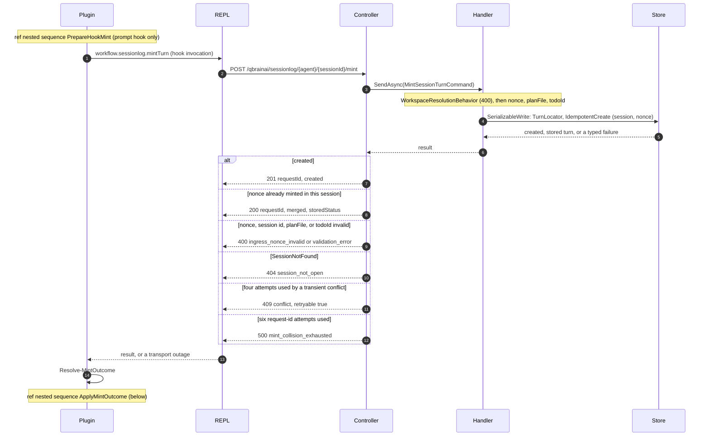
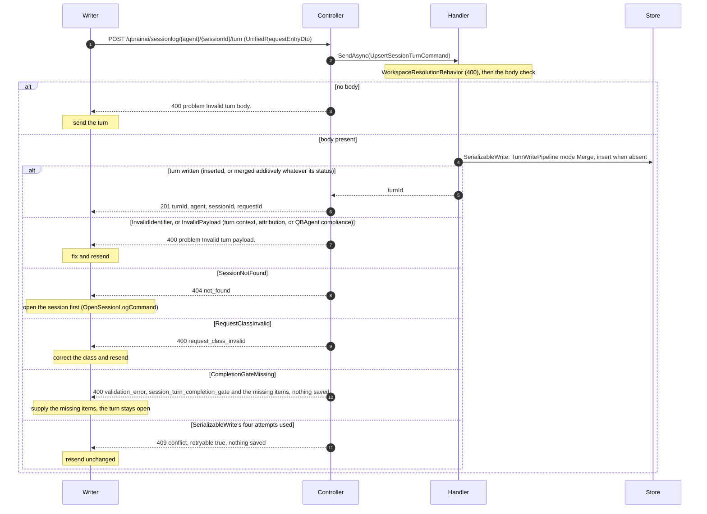
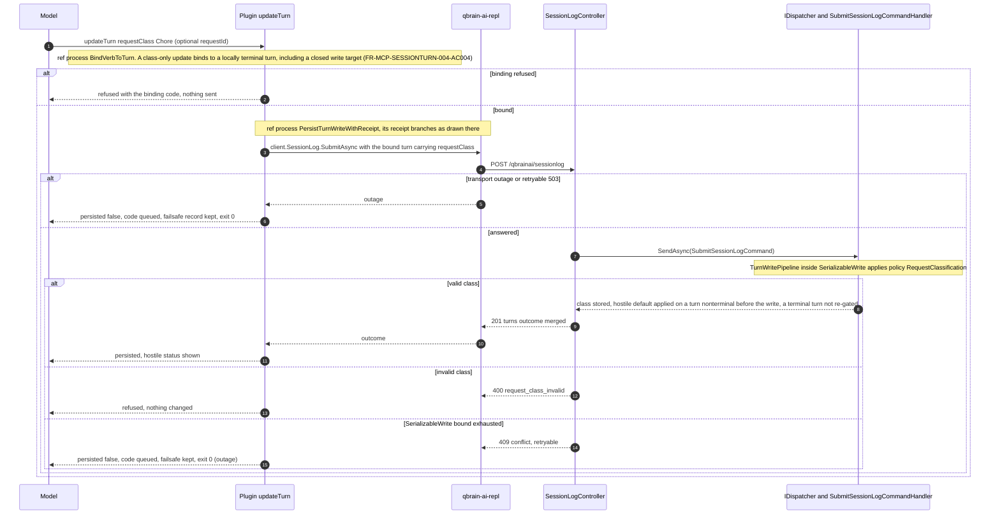
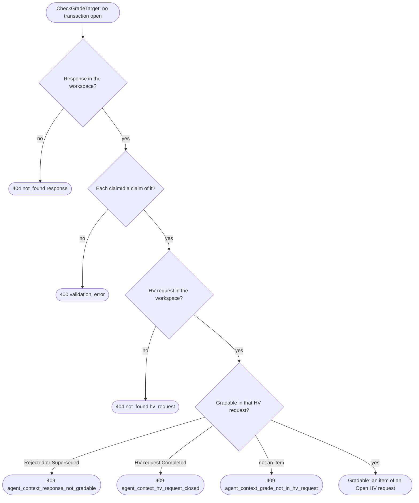
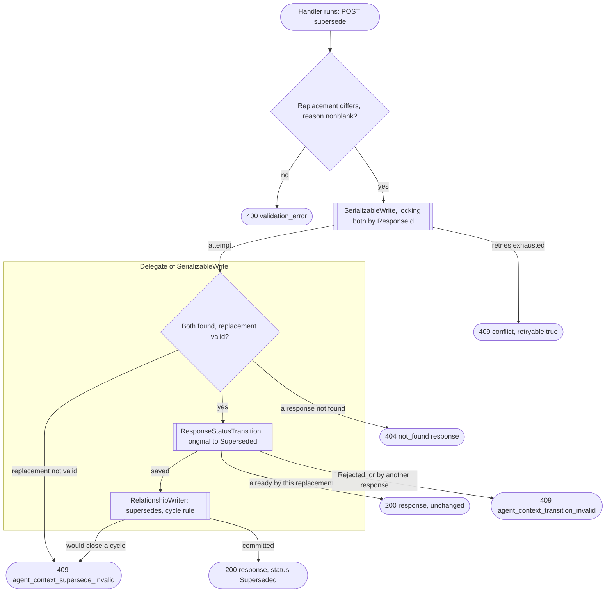
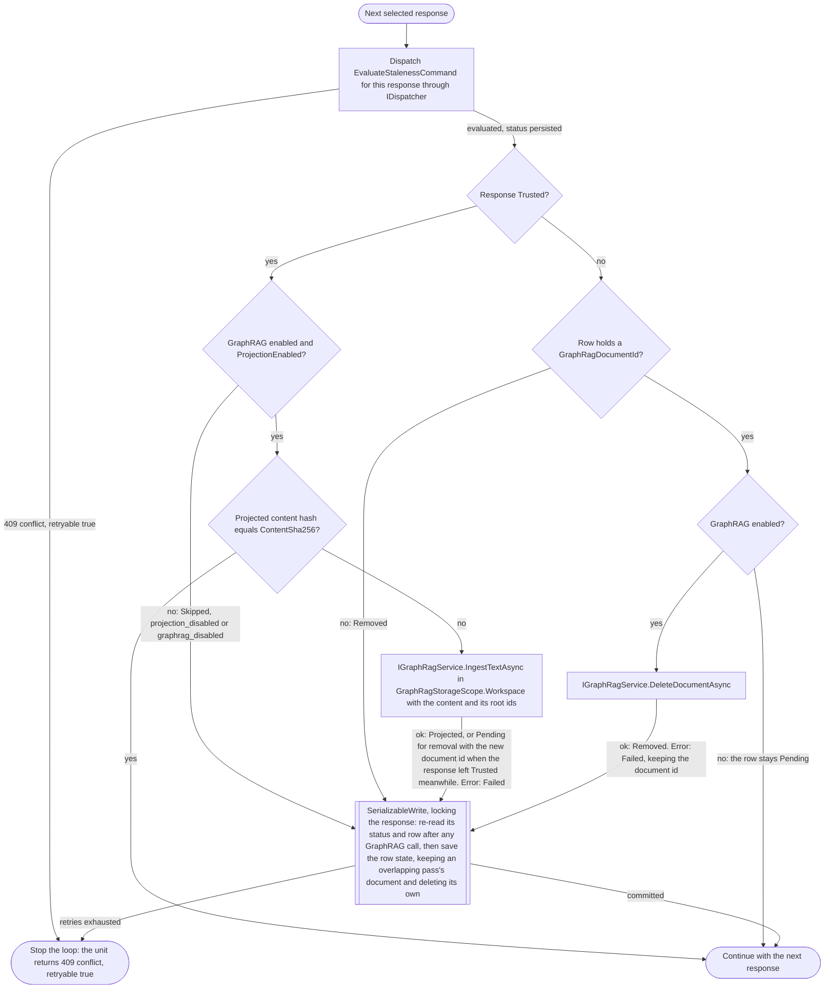
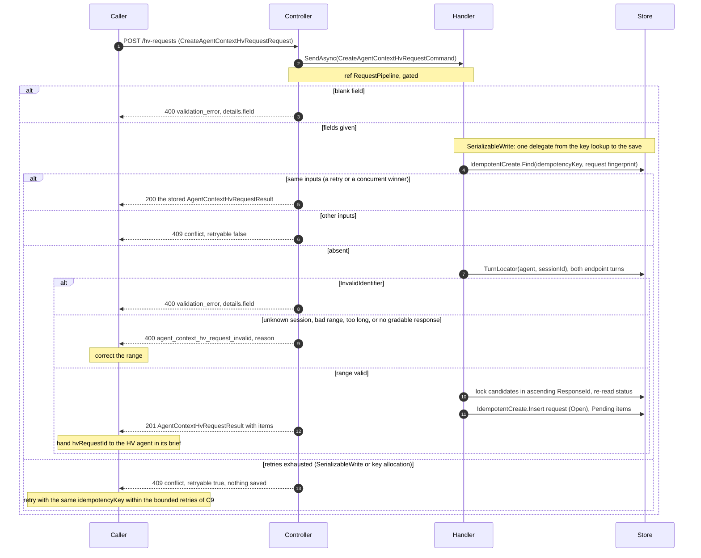
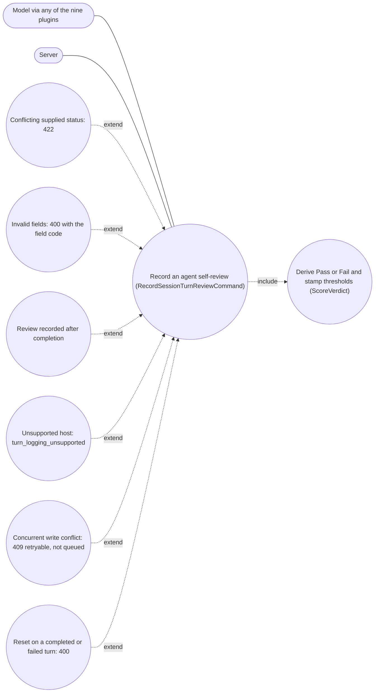

# Original block 56

```mermaid
sequenceDiagram
    autonumber
    participant P as Plugin
    participant R as REPL
    participant C as Controller
    participant H as Handler
    participant D as Store
    Note over P: ref nested sequence PrepareHookMint (prompt hook only)
    P->>R: workflow.sessionlog.mintTurn (hook invocation)
    R->>C: POST /qbrainai/sessionlog/{agent}/{sessionId}/mint
    C->>H: SendAsync(MintSessionTurnCommand)
    Note over H: WorkspaceResolutionBehavior (400), then nonce, planFile, todoId
    H->>D: SerializableWrite: TurnLocator, IdempotentCreate (session, nonce)
    D-->>H: created, stored turn, or a typed failure
    H-->>C: result
    alt created
        C-->>R: 201 requestId, created
    else nonce already minted in this session
        C-->>R: 200 requestId, merged, storedStatus
    else nonce, session id, planFile, or todoId invalid
        C-->>R: 400 ingress_nonce_invalid or validation_error
    else SessionNotFound
        C-->>R: 404 session_not_open
    else four attempts used by a transient conflict
        C-->>R: 409 conflict, retryable true
    else six request-id attempts used
        C-->>R: 500 mint_collision_exhausted
    end
    R-->>P: result, or a transport outage
    P->>P: Resolve-MintOutcome
    Note over P: ref nested sequence ApplyMintOutcome (below)
```

# Original block 61

```mermaid
sequenceDiagram
    autonumber
    participant W as Writer
    participant C as Controller
    participant H as Handler
    participant D as Store
    W->>C: POST /qbrainai/sessionlog/{agent}/{sessionId}/turn (UnifiedRequestEntryDto)
    C->>H: SendAsync(UpsertSessionTurnCommand)
    Note over H: WorkspaceResolutionBehavior (400), then the body check
    alt no body
        C-->>W: 400 problem Invalid turn body.
        Note over W: send the turn
    else body present
        H->>D: SerializableWrite: TurnWritePipeline mode Merge, insert when absent
        alt turn written (inserted, or merged additively whatever its status)
            H-->>C: turnId
            C-->>W: 201 turnId, agent, sessionId, requestId
        else InvalidIdentifier, or InvalidPayload (turn context, attribution, or QBAgent compliance)
            C-->>W: 400 problem Invalid turn payload.
            Note over W: fix and resend
        else SessionNotFound
            C-->>W: 404 not_found
            Note over W: open the session first (OpenSessionLogCommand)
        else RequestClassInvalid
            C-->>W: 400 request_class_invalid
            Note over W: correct the class and resend
        else CompletionGateMissing
            C-->>W: 400 validation_error, session_turn_completion_gate and the missing items, nothing saved
            Note over W: supply the missing items, the turn stays open
        else SerializableWrite's four attempts used
            C-->>W: 409 conflict, retryable true, nothing saved
            Note over W: resend unchanged
        end
    end
```

# Original block 94

```mermaid
sequenceDiagram
    autonumber
    participant M as Model
    participant P as Plugin updateTurn
    participant R as qbrain-ai-repl
    participant S as SessionLogController
    participant X as IDispatcher and SubmitSessionLogCommandHandler
    M->>P: updateTurn requestClass Chore (optional requestId)
    Note over P: ref process BindVerbToTurn. A class-only update binds to a locally terminal turn, including a closed write target (FR-MCP-SESSIONTURN-004-AC004)
    alt binding refused
        P-->>M: refused with the binding code, nothing sent
    else bound
        Note over P,R: ref process PersistTurnWriteWithReceipt, its receipt branches as drawn there
        P->>R: client.SessionLog.SubmitAsync with the bound turn carrying requestClass
        R->>S: POST /qbrainai/sessionlog
        alt transport outage or retryable 503
            R-->>P: outage
            P-->>M: persisted false, code queued, failsafe record kept, exit 0
        else answered
            S->>X: SendAsync(SubmitSessionLogCommand)
            Note over X: TurnWritePipeline inside SerializableWrite applies policy RequestClassification
            alt valid class
                X-->>S: class stored, hostile default applied on a turn nonterminal before the write, a terminal turn not re-gated
                S-->>R: 201 turns outcome merged
                R-->>P: outcome
                P-->>M: persisted, hostile status shown
            else invalid class
                S-->>R: 400 request_class_invalid
                P-->>M: refused, nothing changed
            else SerializableWrite bound exhausted
                S-->>R: 409 conflict, retryable
                P-->>M: persisted false, code queued, failsafe kept, exit 0 (outage)
            end
        end
    end
```

# Original block 121

```mermaid
flowchart TD
    S(["CheckGradeTarget: no transaction open"]) --> F{"Response in the workspace?"}
    F -->|no| E8(["404 not_found response"])
    F -->|yes| CK{"Each claimId a claim of it?"}
    CK -->|no| E6(["400 validation_error"])
    CK -->|yes| HR{"HV request in the workspace?"}
    HR -->|no| E10(["404 not_found hv_request"])
    HR -->|yes| GQ{"Gradable in that HV request?"}
    GQ -->|"Rejected or Superseded"| E9(["409 agent_context_response_not_gradable"])
    GQ -->|"HV request Completed"| E11(["409 agent_context_hv_request_closed"])
    GQ -->|"not an item"| E12(["409 agent_context_grade_not_in_hv_request"])
    GQ -->|yes| R(["Gradable: an item of an Open HV request"])
```

# Original block 125

```mermaid
flowchart TD
    S(["Handler runs: POST supersede"]) --> V{"Replacement differs, reason nonblank?"}
    V -->|no| E2(["400 validation_error"])
    V -->|yes| SW[["SerializableWrite, locking both by ResponseId"]]
    SW -->|retries exhausted| EC(["409 conflict, retryable true"])
    subgraph TX [Delegate of SerializableWrite]
        F{"Both found, replacement valid?"}
        RT[["ResponseStatusTransition: original to Superseded"]]
        RW[["RelationshipWriter: supersedes, cycle rule"]]
    end
    SW -->|attempt| F
    F -->|"a response not found"| E3(["404 not_found response"])
    F -->|"replacement not valid"| E4(["409 agent_context_supersede_invalid"])
    F -->|yes| RT
    RT -->|"already by this replacement"| SAME(["200 response, unchanged"])
    RT -->|"Rejected, or by another response"| E5(["409 agent_context_transition_invalid"])
    RT -->|saved| RW
    RW -->|"would close a cycle"| E4
    RW -->|committed| OK(["200 response, status Superseded"])
```

# Original block 133

```mermaid
flowchart TD
    S(["Next selected response"]) --> EV["Dispatch EvaluateStalenessCommand for this response through IDispatcher"]
    EV -->|"409 conflict, retryable true"| X(["Stop the loop: the unit returns 409 conflict, retryable true"])
    EV -->|"evaluated, status persisted"| TR{"Response Trusted?"}
    TR -->|yes| PE{"GraphRAG enabled and ProjectionEnabled?"}
    PE -->|"no: Skipped, projection_disabled or graphrag_disabled"| SV[["SerializableWrite, locking the response: re-read its status and row after any GraphRAG call, then save the row state, keeping an overlapping pass's document and deleting its own"]]
    PE -->|yes| UP{"Projected content hash equals ContentSha256?"}
    UP -->|yes| NX(["Continue with the next response"])
    UP -->|no| ING["IGraphRagService.IngestTextAsync in GraphRagStorageScope.Workspace with the content and its root ids"]
    TR -->|no| DOC{"Row holds a GraphRagDocumentId?"}
    DOC -->|"no: Removed"| SV
    DOC -->|yes| GE{"GraphRAG enabled?"}
    GE -->|"no: the row stays Pending"| NX
    GE -->|yes| DEL["IGraphRagService.DeleteDocumentAsync"]
    ING -->|"ok: Projected, or Pending for removal with the new document id when the response left Trusted meanwhile. Error: Failed"| SV
    DEL -->|"ok: Removed. Error: Failed, keeping the document id"| SV
    SV -->|committed| NX
    SV -->|retries exhausted| X
```

# Original block 173

```mermaid
sequenceDiagram
    autonumber
    participant Caller
    participant Controller
    participant Handler
    participant Store
    Caller->>Controller: POST /hv-requests (CreateAgentContextHvRequestRequest)
    Controller->>Handler: SendAsync(CreateAgentContextHvRequestCommand)
    Note over Controller,Handler: ref RequestPipeline, gated
    alt blank field
        Controller-->>Caller: 400 validation_error, details.field
    else fields given
        Note over Handler,Store: SerializableWrite: one delegate from the key lookup to the save
        Handler->>Store: IdempotentCreate.Find(idempotencyKey, request fingerprint)
        alt same inputs (a retry or a concurrent winner)
            Controller-->>Caller: 200 the stored AgentContextHvRequestResult
        else other inputs
            Controller-->>Caller: 409 conflict, retryable false
        else absent
            Handler->>Store: TurnLocator(agent, sessionId), both endpoint turns
            alt InvalidIdentifier
                Controller-->>Caller: 400 validation_error, details.field
            else unknown session, bad range, too long, or no gradable response
                Controller-->>Caller: 400 agent_context_hv_request_invalid, reason
                Note over Caller: correct the range
            else range valid
                Handler->>Store: lock candidates in ascending ResponseId, re-read status
                Handler->>Store: IdempotentCreate.Insert request (Open), Pending items
                Controller-->>Caller: 201 AgentContextHvRequestResult with items
                Note over Caller: hand hvRequestId to the HV agent in its brief
            end
        else retries exhausted (SerializableWrite or key allocation)
            Controller-->>Caller: 409 conflict, retryable true, nothing saved
            Note over Caller: retry with the same idempotencyKey within the bounded retries of C9
        end
    end
```

# Original block 182

```mermaid
flowchart LR
    MD(["Model via any of the nine plugins"]) --- U(("Record an agent self-review (RecordSessionTurnReviewCommand)"))
    SV(["Server"]) --- U
    U -. include .-> I1(("Derive Pass or Fail and stamp thresholds (ScoreVerdict)"))
    E1(("Conflicting supplied status: 422")) -. extend .-> U
    E2(("Invalid fields: 400 with the field code")) -. extend .-> U
    E3(("Review recorded after completion")) -. extend .-> U
    E4(("Unsupported host: turn_logging_unsupported")) -. extend .-> U
    E5(("Concurrent write conflict: 409 retryable, not queued")) -. extend .-> U
    E6(("Reset on a completed or failed turn: 400")) -. extend .-> U
```

